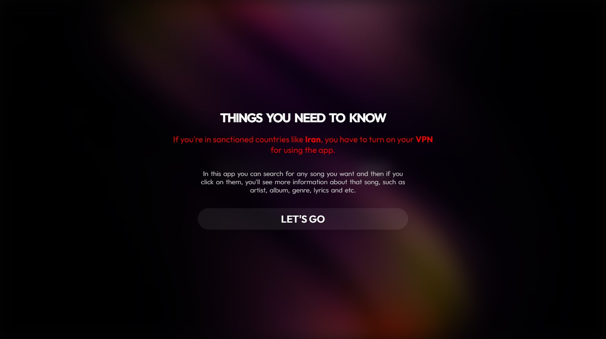
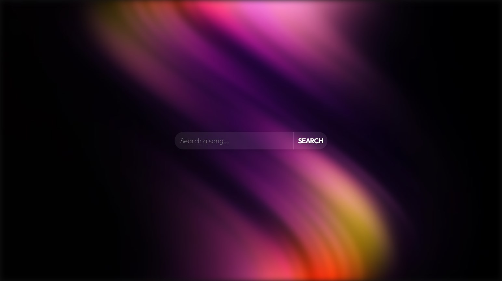
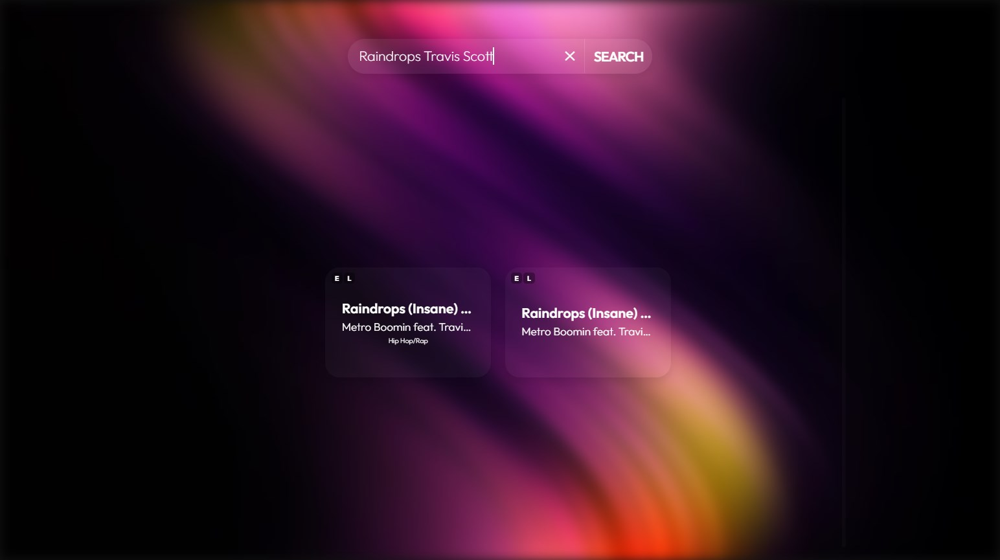
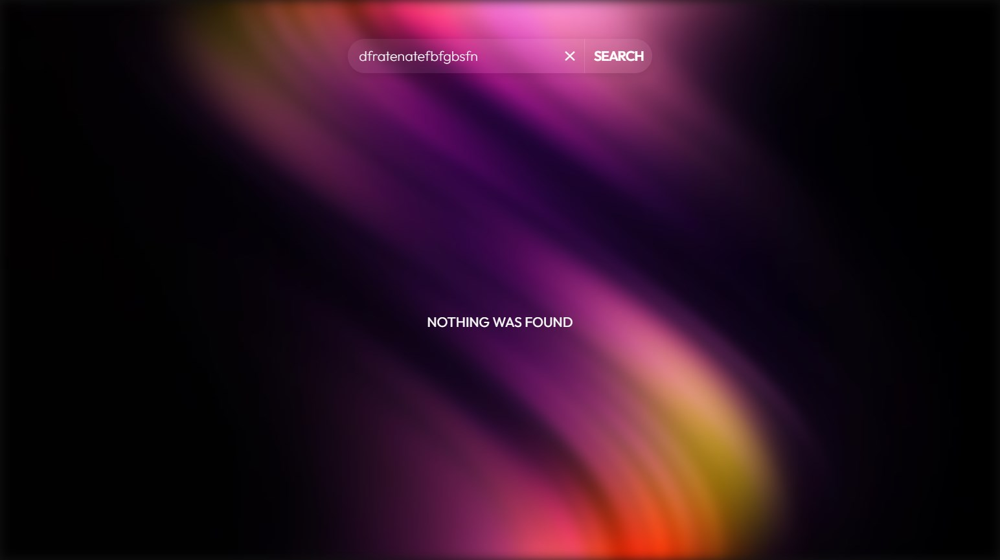
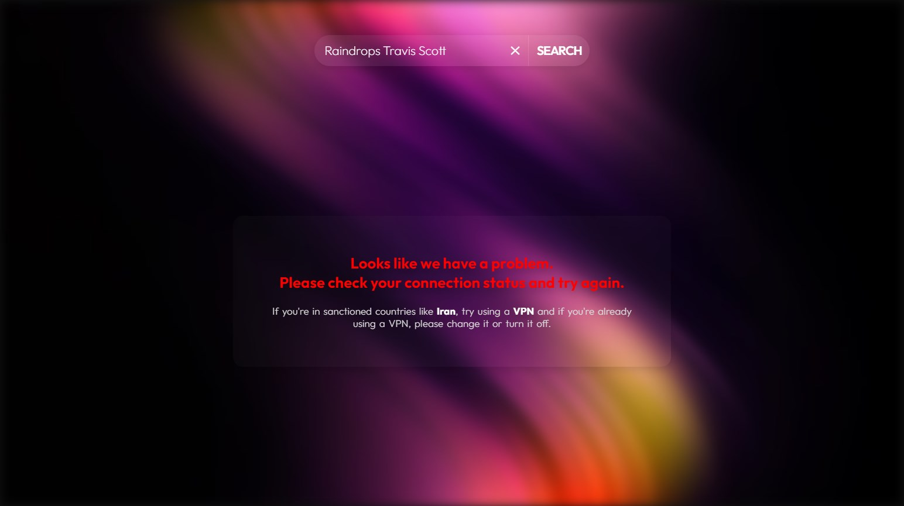
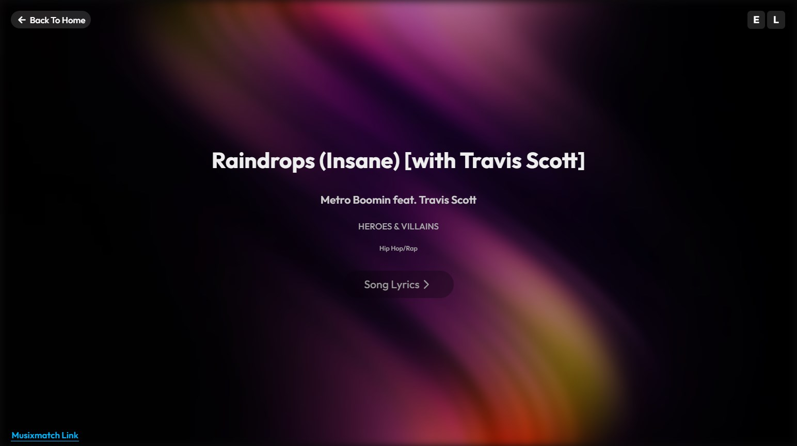
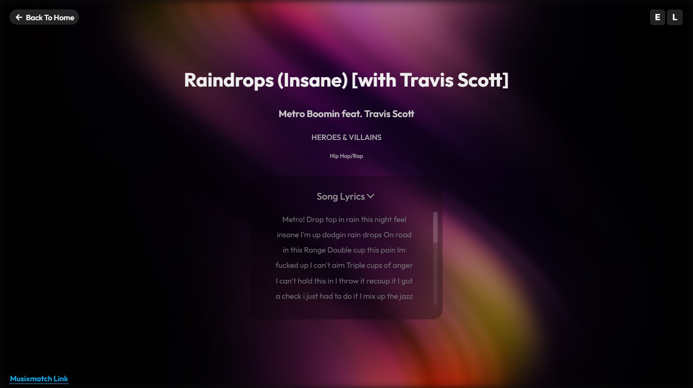
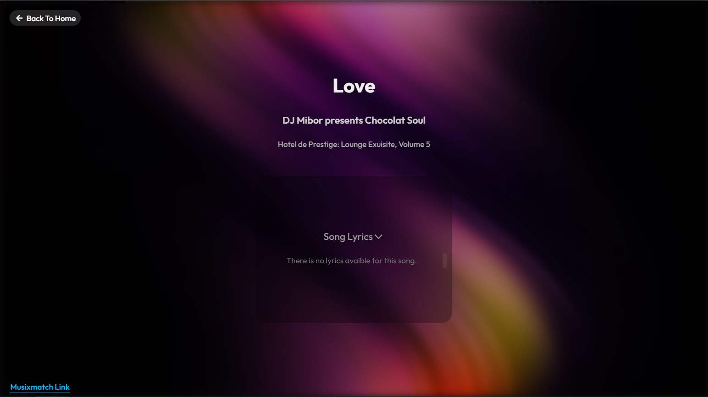

# Lyrics Search

This project allows you to search for any song you want. Then you can visit the song's page to see the lyrics.
 
<a href="https://songs-search.vercel.app/">Check it out :)<a/>
 
 

## How To Use It

When you first open the project, you'll see a warning pop-up. It tells you how you can use the project and what should you do if you're in a sanctioned country. 
 
 

 
 
 
After that, there is a search bar where you can enter the name of the song you want. 
 
 

 
 
 
Then based on what you searched you'll see the songs. 
 
 

 
 
 
Of course if you search nonsense like me you'll get a NOTHING WAS FOUND text. 
 
 

 
 
 
And if you have a bad connection you'll get a connection error. 
 
 

 
 
 
But if everything goes right you can pick what song you want and go to its page. 
 
 
There are two signs in song's box. 
 
 
One of them is the L sign. It means that the song has lyrics. 
 
 
The other one is E sign which means the song has swear words. 
 
 
By clicking on the song's box you can enter to that song page. In the song page we've got the signs, the back home button, title, artists, album, genres, lyrics, and Musixmatch Link (that's because we get all of data from their API). 
 
 

 
 
 
If you want to see the lyrics, all you have to do is to click on Song Lyrics box. Then the box will expand and you'll see the lyrics. 
 
 

 
 
 
If there's no lyrics avaible for the song you'll get "There is no lyrics avaible for this song". 
 
 

 
 
 
By the way we can only see some of the lyrics not all of it because the API is not for commercial use. 
 
 
And by clicking on back home button you'll get back to home page and you can go to another song page or search something completely new.